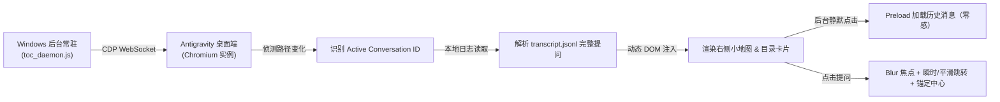

# ⚡ Antigravity Minimap (会话提问目录与侧边小地图)

<p align="center">
  <b>为 Google Antigravity 桌面端量身打造的交互式提问导航目录与侧边时间线小地图</b><br>
  <i>彻底解决长对话翻找提问累、滚动卡顿、历史未加载无法直达的痛点！</i>
</p>

<p align="center">
  
  
  
  
</p>

---

## 📸 效果预览 (Preview)


> **视觉效果说明**：
> - **平时默认状态**：右侧边缘仅收缩为一列精致透明的微型横线刻度轴，完全不占用阅读视线，零干扰；
> - **鼠标悬停状态**：平滑展开半透明磨砂亚克力卡片，清晰罗列本会话的 **全部历史提问**，当前浏览位置高亮突出；
> - **点击精准直达**：点击任意提问，画面直接精准对齐居中，并伴随柔和的荧光绿聚光灯脉冲提示。

---

## 🌟 核心特性 (Key Features)

- 🧭 **全景提问时间线刻度轴**
  在屏幕右侧实时映射整篇会话的提问密度与位置分布，犹如专业 IDE 的代码 Minimap。
- 📋 **悬停悬浮目录卡片**
  鼠标悬停即可查看所有提问的序号与具体文字；支持鼠标在刻度轴或卡片条目上滑动时实时同步对应高亮。
- ⚡ **零等待瞬时直达 (Zero-Waiting Instant Jump)**
  深度重构了分页加载逻辑：在打开会话后，程序在后台**完全静默地以零画面抖动方式预加载历史对话**。点击任何极其早期的提问均已 100% 挂载就绪，**无需任何等待，点击即秒跳**！
- 🚀 **智能动态跳转速度（远快近滑）**
  - **大跨度远距离跳转（> 750px）**：采用瞬时直达（Teleport），杜绝上万像素慢速平滑滚动的掉帧与卡顿；
  - **近距离跳转（<= 750px）**：采用自然平滑滑动，提供优雅舒适的过渡体验。
- 🔄 **视口双向实时联动**
  当您在聊天主窗口中上下翻看对话时，右侧刻度条会自动实时点亮当前正在浏览的提问刻度线（带有 120ms 性能节流，不产生任何布局卡顿）。
- 🛡️ **彻底阻断输入框焦点回弹 (Anti-Lexical Rubber-Banding)**
  Antigravity 底层采用 Lexical 编辑器，原本滚动时会因光标出界强行将视口扯回底部。本插件在点击瞬间剥离光标焦点并进行 250ms 位置锚定，彻底解决“跳过去后又弹回底部”的顽疾。
- 💡 **醒目柔和的荧光聚焦高亮**
  目标提问居中后，会自动施加 2.8 秒的柔和荧光绿外边框与微光投影，随后平滑淡出，助您一眼看清定位点。
- 🔕 **开机全自动静默常驻**
  提供开机无黑框后台运行脚本，日常待机 **CPU 占用 0.0%，内存仅几 MB**。随开随用，Antigravity 打开即刻生效。

---

## 🚀 快速上手 (Quick Start)

### 前置要求
- Windows 10 / 11 操作系统
- 已安装 [Node.js](https://nodejs.org/) (版本 `>= 18.0.0`)
- 已安装并使用 [Google Antigravity](https://antigravity.google/) 独立桌面版

---

### 方法一：一键双击安装 (推荐)

1. 克隆或下载本仓库到本地任意目录：
   ```bash
   git clone https://github.com/zhengjiewen666/antigravity-minimap.git
   ```
2. 进入目录，鼠标双击运行 **`install.bat`**。
3. 脚本会自动完成以下两步：
   - 将静默启动项添加到 Windows 开机自启文件夹 (`shell:startup`)；
   - 立即在后台隐蔽启动守护服务（无任何 CMD 黑框窗口）。
4. **打开 Antigravity，即可在任意会话右侧看到提问小地图！**

---

### 方法二：命令行手动运行

如果您不想加入开机启动，只想临时使用：

```bash
cd antigravity-minimap
node toc_daemon.js
```

保持命令行窗口开启，即可正常使用。

---

## 🗑️ 如何卸载 (Uninstall)

如果未来不需要此功能，非常干净无残留：

- **方式一**：直接双击运行本仓库目录下的 **`uninstall.bat`**，即可一键停止后台进程并清除开机启动项。
- **方式二**：按 `Win + R` 键输入 `shell:startup` 回车，删除里面的 `antigravity_minimap.vbs` 文件即可。

---

## 🔬 技术原理 (How It Works)



1. **CDP (Chrome DevTools Protocol) 自动化挂载**：
   通过读取 Antigravity 运行时的 `DevToolsActivePort` 端口，自动与客户端页面建立 WebSocket 通信，实现轻量级热注入，无需修改或重打包客户端源码（不侵入 `.asar` 文件，客户端升级也不受影响）。
2. **本地 Transcript 结构化解析**：
   直接从本地数据目录读取会话日志，实时提取用户所有真实的提问（`USER_INPUT`），即使未翻页也能准确统计提问总数与完整文本。
3. **DOM 隔离与事件流控制**：
   浮层与刻度条采用独立的高层级绝对定位；跳转时通过调用 `document.activeElement.blur()` 与 `removeAllRanges()`，优雅隔断了富文本编辑器的选区追踪，实现了绝对平稳的视口锚定。

---

## ❓ 常见问题 (FAQ)

#### Q1: 关闭 Antigravity 后，后台守护进程会耗电或占用资源吗？
> **不会**。当检测到 Antigravity 关闭时，Node.js 守护进程仅每 2 秒休眠轮询一次本地端口文件，CPU 占用率始终为 **0.0%**，内存占用不到 **10MB**，毫无性能感知。

#### Q2: 切换不同会话或者新提问时，目录会自动更新吗？
> **会自动更新**。服务内置了 1.5 秒的心跳监听，只要会话 URL 发生改变或新发出了提问，右侧小地图会即时同步最新的提问列表。

#### Q3: 为什么有的很早以前的问题点一下能立刻跳过去，而以前看需要手动等很久？
> 本项目开发了“静默后台预热”机制。在您浏览会话时，后台已经无声无息地按节流节奏把早期的历史批次提前拉取到了 DOM 中，因此当您点击时节点早已就绪，实现 **0ms 秒开秒达**。

---

## 📄 开源许可证 (License)

本项目采用 [MIT License](LICENSE) 开源协议，欢迎自由使用、修改与分享！
