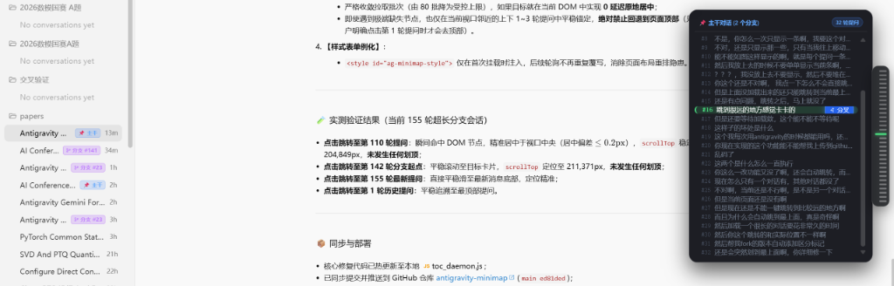
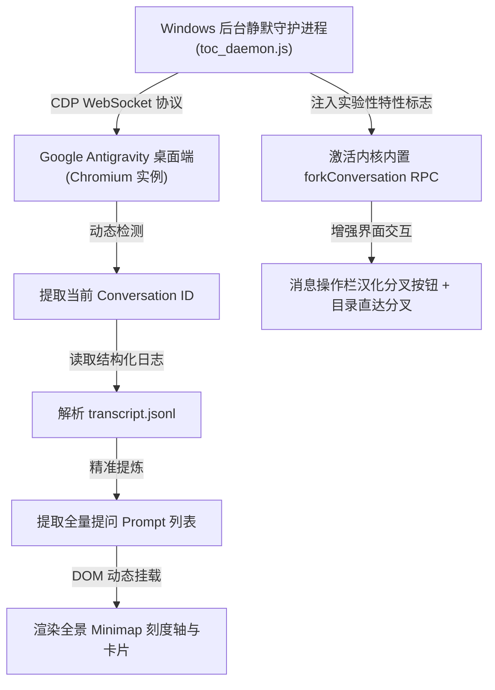

# ⚡ Antigravity Minimap & Gemini Fork

<p align="center">
  <b>为 Google Antigravity 桌面端量身打造的提问目录导航、侧边小地图与 Gemini 网页版同款对话分叉插件</b><br>
  <i>彻底解决长对话翻找提问累、滚动卡顿，并为 Antigravity 带来原生级对话分叉（Branch in new chat）与分支隔离探索体验！</i>
</p>

<p align="center">
  
  
  
  
  
</p>

---

## 📸 效果预览 (Preview)

### 1. 提问导航目录与侧边小地图 (Prompt Minimap)


> - **平时默认状态**：右侧边缘仅收缩为一列精致透明的微型横线刻度轴，完全不占用阅读视线，零干扰；
> - **鼠标悬停状态**：平滑展开半透明磨砂亚克力卡片，清晰罗列本会话的 **全部历史提问**，当前浏览位置高亮突出；
> - **点击精准直达**：点击任意提问，画面直接精准对齐居中，并伴随柔和的荧光绿聚光灯脉冲提示。

### 2. Gemini 网页版同款对话分叉 (Branch in new chat)


> - **每条回复底部分叉按钮**：在每条模型回复底部的操作栏（复制按钮旁）常驻显示分叉图标 `⑂`；
> - **右侧目录一键联动分叉**：悬停右侧提问目录中的任意历史提问，均会浮现专属的 `⑂ 分叉` 胶囊按钮，随时随地一键开启分支！

---

## 🌟 核心特性 (Key Features)

### 🌿 1. Gemini 网页版同款对话分叉 (Conversation Forking)
- 🔀 **历史节点自由分叉**
  与 Gemini 网页版核心体验完全一致！当你想在某个历史回答的基础上尝试不同的追问方向或推导备选方案时，无需重新建立对话并复制背景，直接点击分叉即可！
- 🧠 **完整继承历史上下文**
  新分支完整保留并继承分叉点之前的所有 Prompt、AI 回答、系统提示词与状态记忆，之后产生的新对话与原会话**双向隔离、互不干扰**。
- 🎯 **双重便捷入口**
  1. **消息工具栏入口**：每条 AI 回复底部时间戳旁直接点击 `⑂` 分叉图标；
  2. **提问大纲直达入口**：右侧悬浮目录中的每个问题条目均有 `⑂ 分叉` 胶囊按钮，免去长屏滚动的烦琐。
- 📦 **两种分叉模式按需选择**
  - **在当前工作区创建分支（100% 对应 Gemini 网页版）**：只分叉会话记忆与思考上下文，共用当前工程目录，适合绝大多数方案研讨与代码编写；
  - **在独立共享工作区创建分支（代码沙盒模式）**：结合 Git Worktree 机制，在磁盘上开辟独立的代码副本隔离区，适合高破坏性的大规模重构实验。

---

### 🧭 2. 交互式提问导航目录 (Interactive Minimap)
- ⏱️ **全景提问时间线刻度轴**
  在屏幕右侧实时映射整篇长会话的提问密度与位置分布，犹如专业 IDE 的代码 Minimap。
- ⚡ **零等待瞬时直达 (Zero-Waiting Instant Jump)**
  深度优化分页加载：打开会话后后台**以零画面抖动方式预加载历史对话**，点击早期历史提问 100% 秒级对齐！
- 🚀 **智能动态跳转速度（远快近滑）**
  - **大跨度远距离跳转（> 750px）**：采用瞬时直达（Teleport），杜绝上万像素慢速平滑滚动的掉帧与卡顿；
  - **近距离跳转（<= 750px）**：采用自然平滑滑动，提供优雅舒适的过渡动效。
- 🔄 **视口双向实时联动**
  在主窗口中上下翻看对话时，右侧刻度条会自动实时点亮当前正在浏览的提问刻度线（带有 100ms 性能节流，不产生任何重排卡顿）。
- 🛡️ **阻断输入框焦点回弹 (Anti-Lexical Rubber-Banding)**
  Antigravity 底层采用 Lexical 编辑器，原本滚动时会因光标出界强行将视口扯回底部。本插件在点击瞬间剥离光标焦点并进行多重微调锚定，彻底解决“跳过去后又弹回底部”的痛点。
- 💡 **醒目柔和的荧光聚焦高亮**
  目标提问居中后，会自动施加 2.8 秒的柔和荧光绿外边框与微光投影，随后平滑淡出，助您一眼看清定位点。
- 🔕 **开机全自动静默常驻**
  提供开机无黑框后台运行脚本，日常待机 **CPU 占用 0.0%，内存仅几 MB**。随开随用，Antigravity 打开即刻生效。

---

## 💡 分叉模式对比：两个选项选哪个？

在点击分叉图标时，弹出的菜单包含两个选项：

| 对比维度 | ① 在当前工作区创建分支 | ② 在独立共享工作区创建分支 |
| :--- | :--- | :--- |
| **对话历史** | 完整继承分叉点前的全部上下文 | 完整继承分叉点前的全部上下文 |
| **磁盘代码文件** | **共用当前文件夹**（无额外副本） | **独立隔离副本**（类似 Git 新分支工作树） |
| **对应 Gemini 网页版** | **完全一致（日常推荐此项）** | Gemini 网页版无本地文件概念，此为 Antigravity 编程扩展 |
| **适用场景** | **日常答疑、思考讨论、论文研读、探索不同问法** | **尝试有风险的代码修改、大规模破坏性重构实验** |

> [!TIP]
> 如果您只是想实现和 **Gemini 网页版一模一样**的讨论分支探索，直接点击**第 1 项【在当前工作区创建分支】**即可！

---

## 🚀 快速安装与使用 (Installation)

### 前置要求
- Windows 10 / 11 操作系统
- 已安装 [Node.js](https://nodejs.org/) (推荐版本 `>= 18.0.0`)
- 已安装并使用 [Google Antigravity](https://antigravity.google/) 桌面端

---

### 方法一：一键双击安装 (推荐)

1. 克隆或下载本仓库到本地任意目录：
   ```bash
   git clone https://github.com/zhengjiewen666/antigravity-minimap.git
   ```
2. 进入目录，鼠标双击运行 **`install.bat`**。
3. 脚本会自动完成以下配置：
   - 将守护程序同步至用户配置目录；
   - 配置 Windows 开机静默自启项 (`shell:startup`)；
   - 立即在后台隐蔽启动守护服务（无黑框）。
4. **打开或刷新 Antigravity，即可在任意会话中体验小地图导航与分叉功能！**

---

### 方法二：命令行手动运行

如果您不想加入开机自启，只想临时测试使用：

```bash
cd antigravity-minimap
node toc_daemon.js
```

保持命令行窗口开启即可正常使用。

---

## 🗑️ 如何卸载 (Uninstall)

如果未来不需要此功能，非常干净无残留：

- **方式一**：直接双击运行本仓库目录下的 **`uninstall.bat`**，即可一键停止后台进程并清除开机启动项。
- **方式二**：按 `Win + R` 键输入 `shell:startup` 回车，删除里面的 `antigravity_minimap.vbs` 文件即可。

---

## 🔬 技术原理 (Architecture)



1. **会话解析**：实时监控活动会话路径，直接读取本地持久化数据解析真实提问链；
2. **内核分叉激活**：通过 CDP 开启 Antigravity 官方受限的 `enable-conversation-forking` 与 `enable-fork-at-historical-step` 实验性门控；
3. **UI 无侵入注入**：纯 DOM / CSS 级增强与事件委托，零侵入修改 Antigravity 核心文件，软件更新不受破坏。

---

## 📄 开源许可证 (License)

本项目基于 [MIT License](LICENSE) 开源发布。
